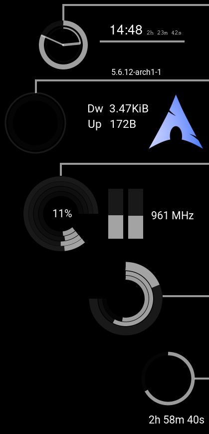

# Conky-Minimalism-tweaked
A Simple Conky config tweaked by myself, a git repo just to save it tbh

Credits to NoTranslation, repo at NoTranslation/Conky-Minimalism from where I got 99% of the code, and let's not forget the others devs you can find in the commit history.
The whole works use the rings\_lua framework

Basically tweaked color, changed some things for a **much** better ressource consumption, added numbers to CPU temp bars and added freqs value. A lot of these things are specific to my own hardware config, you'll have to tinker (probably).

If you want a simple conky working out-of-the box with your 16-cores threadripper I'd suggest looking at the original repo

**Requires:**
* ttf-roboto  |  [AUR](https://www.archlinux.org/packages/community/any/ttf-roboto/)
* Conky with lua support | [AUR](https://aur.archlinux.org/packages/conky-lua/)
* lm-sensors | [AUR](https://www.archlinux.org/packages/?name=lm_sensors)

## Installation
1. Extract the zip file
2. Change the paths in minimalismRC & startup.sh
3. Run startup.sh

Note: If Core temps are not displayed correctly, see line 264 in clocks.lua

For CPU freq, make sure /proc/cpuinfo contains the relevant data as I am only reading it

